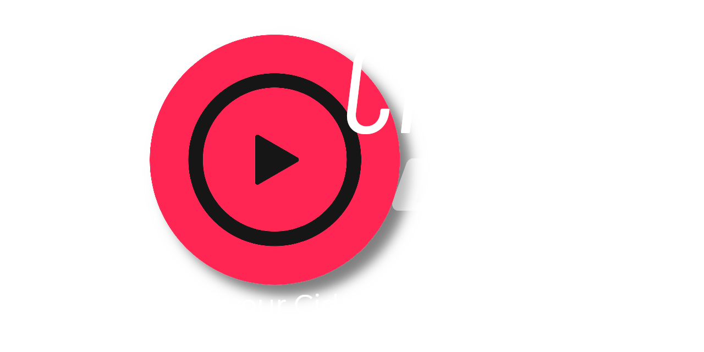

# 🍎 CiderWS 🎶
## NodeJS wrapper for the Apple Music client [Cider](https://github.com/ciderapp/Cider)
[](https://github.com/ryzetech/CiderWS) [](https://github.com/ryzetech/CiderWS/issues) [](https://discord.gg/N9CuvqJtFK)




# About
Cider [(cider.sh - an open-source client for Apple Music)](https://cider.sh/) has a WebSocket API. Yes, I wouldn't have thought either! But, unlike the REST API, calling it "documentated" would be a blunt lie because documentation... doesn't exist. No worries tho! I had the absolute boredom to do some digging in the JavaScript code for the Web Remote and here we are. I just wrote this as a part of a cool VS Code extension... Oh well...

### A thing to note
This will be my first ever npm package. Please don't be mad at me when I made mistakes, didn't work efficiently or overlooked flaws. Just be patient, create an issue or even open a merge request with your fix! I will gladly take every help I can get! :D

# Installation
soon tm

# Documentation
## Methods
### `connect()`
This one is easy. You don't even have to call it because it gets called in the constructor anyways (the call gets ignored if a connection is already established). If you have closed it with the [`close()`](#close) function, you may want to reopen it. That's why this method exists.

### `close()`
That closes the websocket connection. You should do that at some point to provide a clean exit.

### `forceUpdate()`
Forces CiderWS to fetch and update the current song and states. This is not instant tho, so use [`async getSong()`](#async-getsong) and [`async getStates()`](#async-getstates) or the event-based system if you want to be absolutely sure!

### `async getSong()`
Returns a Promise, which eventually resolves to a [`Song`](#song) object of the current or last played song. Useful if you don't want to use the event-based system.

### `async getStates()`
Returns a Promise, which eventually resolves to a [`States`](#states) object of the current or last states. Useful if you don't want to use the event-based system.

### `play()`, `pause()`, `next()`, `previous()`
Pretty self-explanatory. You can influence the playback behaviour with those functions. They aren't Promise-based so you don't have to wait for shit. They essentially just do websocket calls.

### `seek(time, adjust)`
This function lets you skip to a time in the current song. `time` is a timestamp in seconds. If `adjust` is true, `time` has to be passed in milliseconds.  
**Note:** No idea why I included the adjust parameter, it's in the API so it has to be useful for something.

### `setVolume(volume)`
This function accepts a number between 0 and 1 as `volume`. It sets the playback volume of the player.  

### `cycleRepeat()`
This function lets you cycle through all three repeat modes. To set the repeat mode directly, check [`async setRepeat()`](#async-setrepeatmode).  

### `async setRepeat(mode)`
Sets the repeat mode directly to the number given to `mode` (0 = no repeat, 1 = song, 2 = playlist).

### `toggleShuffle()`
Toggles the shuffle mode on or off. To set the shuffle mode directly, check [`setShuffle()`](#setshuffleenabled).

### `setShuffle(enabled)`
Sets the shuffle mode to the boolean given to `enabled`.  

### `async getLyrics()`
Returns the lyrics of the current song as a `string` if there are any. You get a nice text block with all lines. **Note:** This could return an empty string when there are no lyrics.

### `async getLyricsAdvanced()`
Returns the lyrics as an array of objects with the following properties:
| Property    | Type   | Usage                                                      |
|-------------|--------|------------------------------------------------------------|
| startTime   | number | Marks the time in seconds where this line is played        |
| endTime     | number | Marks the time in seconds where this line stops            |
| line        | string | The actual lyric line. duh                                 |
| translation | string | The translation of the line if chosen in the Cider options |

Example:
```json
[
  "..."
  {
    "startTime": 44.3,
    "endTime": 46.1,
    "line": "Never gonna give you up",
    "translation": ""
  },
  {
    "startTime": 46.1,
    "endTime": 48.5,
    "line": "Never gonna let you down",
    "translation": ""
  },
  {
    "startTime": 48.5,
    "endTime": 52.3,
    "line": "Never gonna run around and desert you",
    "translation": ""
  },
  "..."
]
```
**Note:** This could also return an empty array when there are no lyrics.


## Events
Cider bombards every connected websocket with playback data, which CiderWS filters for you.  
The three main events are `songUpdate`, `statesUpdate` and `playbackUpdate` and two related to websocket stuff, `connectionOpen` and `connectionClose`. You get some data with them, too!
- `songUpdate` = = => [`Song`](#song) object
- `statesUpdate` = => [`States`](#states) object
- `playbackUpdate` => [`PlaybackData`](#playbackdata) object

So far, so simple.  
Listen for events with the structure you would expect:
```js
const { CiderWS } = require("./ciderws.js"); // note: npm rollout soon™
const cider = new CiderWS();

cider.on("songUpdate", (data) => {
  // do shit
});
```
Additionally, I'm also "forwarding" all messages Cider sends, just in case you want the raw data. The type of the message on the websocket is also the event to listen for, for example `generic` or `playbackStateUpdate` (I don't know why you would want to do that tho).  

## Classes
### Song
The Song class packs up some nice information about the current playing title.
| Property    | Type   | Usage                                |
|-------------|--------|--------------------------------------|
| id          | string | The song ID                          |
| title       | string | The song name                        |
| artist      | string | The song artist                      |
| album       | string | The song album                       |
| artwork     | string | The song's album art URL             |
| trackNumber | number | The song's track number on the album |
| duration    | number | The song duration in seconds         |
| url         | string | The Apple Music URL for the song     |

### States
This class saves the current options and states for the player when defined by the client.
| Property    | Type    | Usage                                                       |
|-------------|---------|-------------------------------------------------------------|
| isPlaying   | boolean | Is a title playing?                                         |
| isShuffling | boolean | Is shuffling enabled?                                       |
| repeatMode  | number  | Current repeat mode (0 = no repeat, 1 = song, 2 = playlist) |
| volume      | number  | How loud is the player (from 0 to 1)?                       |
| autoplay    | boolean | Is autoplay enabled?                                        |

### PlaybackData
This class shows data relevant for the current playback, e.g. elapsed time, remaining time, the timestamp when the song will end, etc.
| Property      | Type    | Usage                                           |
|---------------|---------|-------------------------------------------------|
| isPlaying     | boolean | Is a title playing?                             |
| startTime     | number  | The timestamp at which the song started playing |
| endTime       | number  | The timestamp at which the song will end        |
| remainingTime | number  | The remaining time in milliseconds              |
| elapsedTime   | number  | The elapsed time in milliseconds                |
| progress      | number  | The progress of the song in decimal form (0-1)  |

# Disclaimer
*This project is NOT affiliated with Cider in any way shape or form (yet). The project is open source and free to use. 
For any legal concerns contact me at <a href="mailto:legal@ryzetech.live">legal@ryzetech.live</a>.*

# Thanks ❤
Thank you [@SteffTek](https://github.com/SteffTek) for providing me with a base to work with, [@ArcticSpaceFox](https://github.com/ArcticSpaceFox) for giving me advice and energy to do this, and [@FoxInAScarf](https://github.com/FoxInAScarf) for listening to my rants.